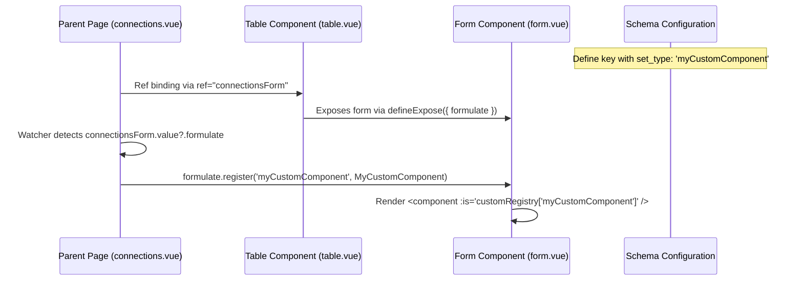

# Adding Custom Form Components (Formulate Registry)

This guide documents the process of creating and registering custom component types (e.g., `myCustomComponent`) to render custom inputs inside dynamically generated forms in the administrative tables.

---

## Process Overview

The integration relies on a runtime component registry in the form engine. When a form renders, it dynamically resolves the custom type from this registry and injects the component.



---

## Step-by-Step Implementation

### Step 1: Create the Component
Create a standard Vue 3 SFC for the input control. It must support model binding via `v-model` (`modelValue` prop and `update:modelValue` emit).

**Example (`app/components/myCustomComponent.vue`):**
```vue
<template>
  <div class="custom-input-wrapper">
    <p>hi from myCustomComponent</p>
    <!-- Custom input bindings -->
  </div>
</template>

<script setup lang="ts">
const props = defineProps<{
  modelValue: any;
  header: any;
  rules?: any[];
}>();

const emit = defineEmits(['update:modelValue']);
</script>
```

### Step 2: Define the Component Type in Schema
In the corresponding header schema file, set the field's `set_type` to match the name of the custom type you want to register.

**Example (`app/schemas/connections_imap.ts`):**
```typescript
export default [
    // ...
    { 
      title: t('table.connections_imap.name'), 
      key: 'name', 
      set_type: "myCustomComponent", // Identifies the custom registry key
      rules: rules.name 
    },
    // ...
];
```

### Step 3: Expose the Registry from Table Component
The `Table` component encapsulates the inner `FormWrapper` component. To register custom components, the `Table` must expose the inner form component instance as `formulate`.

**Example (`table.vue`):**
```typescript
// Expose the inner form ref (formRef) to the parent page
defineExpose({
  formulate: formRef
});
```

### Step 4: Register the Component on Mount
In the parent page containing the `<Table />`, import the custom component and watch for the table's exposed `formulate` property. Once it is available, register the custom component under its custom type name.

**Example (`app/pages/connections.vue`):**
```vue
<template>
  <v-container class="d-flex flex-column align-center ga-5">
    <!-- Bind the template ref -->
    <Table ref="connectionsForm" :meta="connectionsMeta" class="mb-6" />
    <notifications />
  </v-container>
</template>

<script setup lang="ts">
import { ref, watch } from 'vue';
import connectionsMetaFcn from '~/schemas/connections_imap';
import myCustomComponent from '~/components/myCustomComponent.vue'; // Import custom component

const t = useI18n().t;
const connectionsMeta = connectionsMetaFcn(t);
const connectionsForm = ref<any>(null);

// Watch for Table formulation ready state and register
watch(() => connectionsForm.value?.formulate, (formulate) => {
  if (formulate) {
    formulate.register("myCustomComponent", myCustomComponent);
  }
});
</script>
```

---

## Technical Details

### Registry Implementation
Within `form.vue`, custom components are stored in a `shallowReactive` object to prevent deep reactivity overhead:

```typescript
import { shallowReactive } from 'vue';
import type { Component } from 'vue';

const customRegistry = shallowReactive<Record<string, Component>>({});

const register = (type: string, component: Component) => {
  customRegistry[type] = component;
};

defineExpose({
  register
});
```

### Dynamic Rendering Loop
Inside the form's template, fields check the registry before falling back to default form input controls:

```vue
<template v-for="header in headers" :key="header.key">
  <!-- 1. Check custom registry -->
  <component
    v-if="customRegistry[header.set_type]"
    :is="customRegistry[header.set_type]"
    v-model="formData[header.key]"
    :header="getResolvedHeader(header)"
    :rules="getRules(header.key)"
  />
  
  <!-- 2. Fallback to default fields -->
  <FormSetStringLine
    v-else-if="header.set_type === 'string_line'"
    v-model="formData[header.key]"
    :header="header"
    :rules="getRules(header.key)"
  />
  
  <!-- ... other default set_types ... -->
</template>
```
